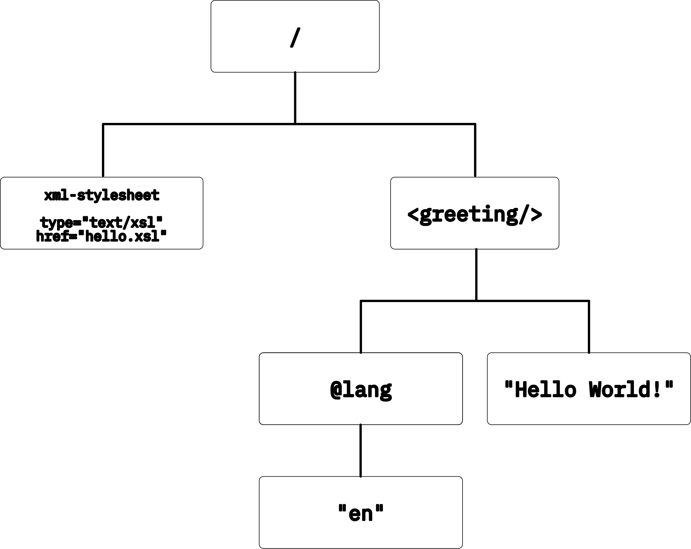

---
title:
    \textbf{Transformations éditoriales avancées}
subtitle:
    LHQ1C1M1\newline
    Master 2 Humanités numériques
lang: fr-FR
beamer: true
urlcolor: red
theme: metropolis
aspectratio: 169
syntax-highlighting: tango
mainfont: "IBM Plex Sans"
monofont: "IBM Plex Mono"
fontsize: 11pt
header-includes:
    - \setbeamerfont{title}{size=\Huge}
    - \setbeamerfont{frametitle}{size=\large, series=\bfseries}
---

## Calendrier des cours

6 séances :

- 6 octobre (8h30-10h30)
    - **XPath** (et 1re XSLT ?)
- 13 octobre (8h30-10h30)
    - **XSLT**, les *templates*, déclarer éléments et attributs, *copy* et *copy-of*
- 10 novembre (8h30-10h30 **et** 13h30-16h30)
    - **XSLT** : les modes, variables et opérations sur les chaînes
    - **XSLT** : *eval. XPath 1h l'après-midi* ; les conditions et boucles
- 17 novembre (13h30-16h30)
    - **XSLT** : les *templates "name"* et fonctions
- 24 novembre (13h30-16h30)
    - *éval. terminale 3h*

---

## Objectifs du cours

- Introduction aux langages XPath et XSLT…
- …essentiellement pour le traitement de documents XML-TEI
- maîtrise des concepts fondamentaux
- panorama des méthodes de publication de documents XML ?

---

## Éléments de définition : XPath & XSLT

- **XPath** : syntaxe non XML pour parcourir un *arbre* XML
- **XSLT** : application XML pour transformer un *arbre* XML

XPath et XSLT sont des standards développés et maintenus par le *World Wide Web Consortium* (W3C)

XPath est un langage *intégré* dans de nombreuses applications XML ou non (DOM, XSLT, XML Schema, XForms, XQuery, etc.)

---

## Éléments de définition : arborescence

Qu'est-ce qu'un *arbre* ?

\pause

Un *arbre* est une structure hiérarchique composée de **nœuds**.

\pause

Qu'est-ce qu'un *nœud* ?

\pause

Un *nœud* correspond à une composante d'un arbre pouvant contenir une sous-arborescence.

---

**Exercice**

Représenter cet arbre XML :

```xml
<?xml version="1.0"?>
<?xml-stylesheet type="text/xsl" href="hello.xsl"?>
<greeting lang="en">Hello World!</greeting>
```

---



---

# XPath

---

## Bibliographie

- Birnbaum D. J. « What can XPath do for me? ». Disponible sur : <[http://dh.obdurodon.org/introduction-xpath.xhtml](http://dh.obdurodon.org/introduction-xpath.xhtml)>
- Harold E. R., Means W. S. XML en concentré : manuel de référence. Paris, France : O’Reilly, 2005. ISBN : 2-84177-353-1.
- « XML Path Language (XPath) 3.1 ». Disponible sur : <[https://www.w3.org/TR/xpath-31/](https://www.w3.org/TR/xpath-31/)>

---

*XPath* peut être utilisé pour effectuer des calculs numériques, manipuler des chaînes de caractères, ou encore évaluer des conditions (booléens), mais surtout :

\bigskip

> « XPath est un langage pour sélectionner des nœuds et ensembles de nœuds \[dans une\] arborescence. »^[Harold, Elliotte Rusty et Means, W. Scott. « XML en concentré : manuel de référence »]

---

Une expression *XPath* est un **chemin** composé d'une série d'étapes, où chaque étape correspond à un type de nœud à traverser.

---

## Chemins de localisation : exercice {.shrink} 

Par quelles étapes doit-on passer pour arriver à l'élément `<title/>` ?

```xml
<?xml version="1.0" encoding="UTF-8"?>
<fileDesc>
    <titleStmt>
        <title>IDC 2506 : Fuss [à Condorcet], 7 août 1778</title>
    </titleStmt>
</fileDesc>
```
\pause 

On commence à l'élément `<fileDesc/>`, puis on passe à l'élément *fils* `<titleStmt/>`  et enfin on arrive au titre `<title/>`.

\pause

Avec XPath : `/fileDesc/titleStmt/title`

---

## Chemins de localisation : départ et étapes

- Le point de départ d'un chemin XPath peut être :
    - la racine (`/`), 
    - le nœud contextuel (`.`),
    - le nœud parent (`..`), 
    - ou *n'importe où* (`//`) ;
- chaque étape est séparée de la précédente par l'opérateur `/`.

---

## Chemins de localisation : exercice

Ouvrir le fichier `gdpBrice1684.tei.xml` dans OxygenXML.

- donner le chemin de localisation absolu de la `racine`, du nœud `TEI` et du nœud `body` ;
- sélectionner tous les nœuds `persName` peu importe où ils se trouvent.

---

## Chemins de localisation : les axes {.allowframebreaks}

Sans indication particulière, on *descend* dans l'arborescence, mais il est possible de naviguer selon différents **axes** :

- `self::` : nœud courant (`.`) ;
- `attribute::` : nœud attribut – c’est un axe particulier (`@nomAttribut`) ;
- `child::` : nœud enfant – seuls les nœuds racine et éléments ont des enfants ;
- `parent::` : le nœud parent (`..`)
- `descendant::` tous les nœuds contenus par le nœud courant (`//`)
- `ancestor::` tous les nœuds qui contiennent le nœud courant
- `ancestor-or-self::` tous les nœuds qui contiennent le nœud courant, y compris ce dernier
- `descendant-or-self::` tous les nœuds contenus par le nœud courant, y compris ce dernier
- `following::` tous les nœuds qui suivent le nœud courant
- `preceding::` tous les nœuds qui précèdent le nœud courant
- `following-sibling::` tous les nœuds qui partagent un parent et suivent le nœud courant
- `preceding-sibling::` tous les nœuds qui partagent un parent et précèdent le nœud courant


---


---

## Chemins de localisation : exercice

- sélectionner tous les nœuds `persName` parents d'un nœud `surname`
- sélectionner tous les nœuds `forename` qui précèdent un nœud `surname` et partagent en même parent.

---

## Chemins de localisation : les nœuds

Il existe **7** types de **nœuds** :

- le nœud *racine* ($\neq$ de l’**élément racine**, on parle aussi de nœud *document*), il est unique (`/`)
- les nœuds *éléments* (`nomElement`)
- les nœuds *attributs* (`@nomAttribut`)
- les nœuds *texte* (`text()`)
- les nœuds *commentaires* (`comment()`)
- les nœuds *instructions de traitement* (`processing-instruction()`)
- les nœuds d’*espace de nom*

---

## Chemins de localisation : les jokers

Les *Jokers*

- `*` : tout nœud élément
- `node()` : n'importe quel nœud
- `@*` : tout nœud attribut

\pause

Les **opérateurs** de séquence

- `|` ou `union` : union
- `intersect` : intersection
- `except` : exclusion
- `()` : combinaison

---

## Chemins de localisation : exercice

- sélectionner tous les attributs `type`.
- séléctionner tous les nœuds parents d'un attribut `rend`.
- sélectionner tous les commentaires.

---

## Chemins de localisation : les prédicats

Les *prédicats* sont des conditions de sélection. Ce sont des expressions XPath placées entre crochets « `[]` » à la suite d'un nœud. Ils correspondent aux conditions que doivent remplir un nœud pour être retenu. Chaque étape d’un chemin XPath peut contenir *0* ou *n* prédicats.

```XPath
//persName[3]

//choice[orig]
```

---

## Chemins de localisation : exercice

- sélectionner tous les nœuds `placeName` qui ont la position 2 dans l'arbre.
- sélectionner tous les nœuds `persName` qui disposent d'un attribut `xml:id`.
- sélectionner tous les nœuds `persName` qui disposent d'un attribut `xml:id` et qui ont pour parent un nœud `p`.

---

## Autres expressions XPath

Les chemins de localisation ne sont pas les seules expressions XPath qui existent. Cependant, ce sont les seules qui peuvent être invoquées dans les attributs `@match` des `<xsl:template/>`.

Xpath peut également être utilisé pour retourner des valeurs aussi diverses que des *chaînes de caractères*, des *nombres* ou des *booléens*.

## Autres expressions XPath : les chaînes de caractères

Les chaînes de caractères (*string*) sont notées entre guillemets simples ou doubles :

```xpath
'On en a gros !'
"Faut pas respirer la compote, ça fait tousser."
"Moi j'ai appris à lire, et ben je souhaite ça à personne !"
```

---

## Autres expressions XPath : les nombres

Une expression XPath peut aussi retourner une nombre entier ou décimal :

```xpath
3
3.14159265359
```

---

## Autres expressions XPath : les nombres

XPath dispose également des 5 *opérateurs arithmétiques* traditionnels

- addition « `+` »
- soustraction « `-` »
- multiplication « `*` »
- division « `div` »
- modulo « `mod` »

```xpath
4 mod 3 <!-- 1 -->
2+2  <!-- 4 -->
```

---

## Autres expressions XPath : les booléens

Un **booléen** est une valeur qui a exactement deux états : *vrai* ou *faux*. XPath ne propose pas de représentation littérale des booléens. On utilise plutôt :

- les fonctions `true()` et `false()` ;
- des expressions booléennes avec des opérateurs de comparaison :
    - égal « `=` »,
    - différent « `!=` »,
    - inférieur* « `<` » et inférieur ou égal* « `<=` »,
    - supérieur* « `>` » et supérieur ou égal* « `>=` ».

Les opérateur "et" « `and` » et "ou" « `or` » permettent de combiner les expressions booléennes.

---

## Autres expressions XPath : les booléens

```xpath
//p[position() > 1]
//chapitre[head != 'Introduction']
//chapitre/[@type = 'Introduction' or @type = 'conclusion']
```

---

## Autres expressions XPath : exercice

- Sélectionner toutes les *divisions* de type *section*.
- Sélectionner tous les *nœuds* avec un attribut *rend* égal à *superscript* ou *initial*

---

## Les fonctions XPath

XPath dispose également d'un ensemble de fonctions afin d'effectuer des opérations sur les nœuds, les chaînes de caractères, les nombres, les booléens, etc.

---

## Les fonctions XPath sur les nombres

-  `number(object?)` *number* : convertit son argument en nombre
-  `sum(node-set nodes)` *number* : somme de tous les nœuds en argument
-  `floor(number x)` *number* : retourne le plus grand entier inférieur ou égal à x
-  `ceiling(number x)` *number* : retourne le plus petit entier supérieur ou égal à x
-  `round(number x)` *number* : retourne l’entier le plus proche de x

---

## Les fonctions XPath sur les nombres

```xml
<node>2</node>

/node/number() => 2.0
<!-- ou -->
/number(node)
```

---

## Les fonctions XPath sur les booléens

- `boolean(object o)` *boolean* : convertit l’argument en booléen
- `not(boolean)` *boolean* : inverse la valeur de l’argument (vrai devient faux et faux devient vrai)
- `true()` *boolean* : retourne toujours vrai
- `false()` *boolean* : retourne toujours faux

---

## Les fonctions XPath sur les booléens

```xml
<node>string</node>

boolean(/node) => true
boolean(/node/sub)=> false
not(boolean(/node/sub))=> true
```

---

## Les fonctions XPath sur les nœuds

- `position()` *number* : position du nœud courant dans l’ensemble contextuel
- `count(nodeset?)` *number* : compte le nombre de nœuds en argument
- `local-name(node-set?)` *string* : retourne le nom local du nœud
- `name(node-set?)` *string* : retourne le nom qualifié du nœud (préfixe + nom local)
- `namespace-uri(node-set?)` *string* : retourne l’espace de nom du nœud

---

## Les fonctions XPath sur les nœuds

```xml
<root>
    <node/>
    <node/>
</root>
//node/position() => (1, 2)

count(//node) => 2

<ns:root xmlns:ns="http://ns">
    <ns:node/>
</ns:root>
name(/ns:root) => ns:root (préfixe + nom)
local-name(/ns:root) => root
```

---

## Les fonctions XPath sur les chaînes de caractères

- `string(string?)` *string* : convertit un objet en chaîne de caractères
- `concat(string, string, string*)` *string* : concatène les arguments
- `normalize-space(string?)` *string* : retire les blancs en début ou fin de chaîne, et remplace les groupes d’espaces ou les retour à la ligne par un espace unique
- `string-length(string?)` *number* : retourne la longueur de la chaîne de caractères en argument
- `starts-with(string s1, string s2)` *boolean* : vérifie si la chaîne s1 commence par la chaîne s2

---

## Les fonctions XPath sur les chaînes de caractères

```xml
<root>
    <node>10</node>
</root>
/root/node/string() => '10'
/root/node/string-length() => 2

concat('Hello', ' World') => 'Hello World'

<node att="Hello">World</node>
/node/concat(@att, .) => 'HelloWorld'
```

---

## Les fonctions XPath sur les chaînes de caractères

- `contains(string s1, string s2)` *boolean* : vérifie que la chaîne s1 contient la chaîne s2
- `substring-before(string s1, string s2)` *string* : retourne la sous-chaîne de s1 placée avant s2
- `substring-after(string s1, string s2)` *string* : retourne la sous-chaîne de s1 placée après s2
- `substring(string s, index, length?)` *string* : retourne la sous-chaîne de s commençant à l’index et de longueur lenght
- `translate(string s1, string s2, string s3)` *string* : remplace dans s1 chaque occurrence de s2 par une occurrence de s3

---

## Les fonctions XPath sur les chaînes de caractères

```xml
<root>
    <node>Hello World</node>
</root>

/root/node/contains(., 'Hello') => true
substring-before(/root/node, ' World') => 'Hello'
substring(/root/node, 7, 5) => World
substring(/root/node, 7) => World
```

---

## Les fonctions XPath sur les chaînes de caractères : exercice

- pour chaque `persName` fils d'un `respStmt`, effectuer la concaténation des nœuds fils `forename` et `surname`.
- chercher tous les `placeName` qui contiennent le mot *église*.